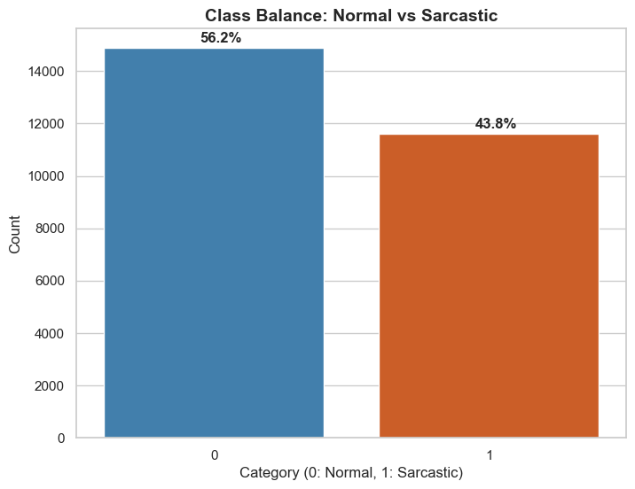
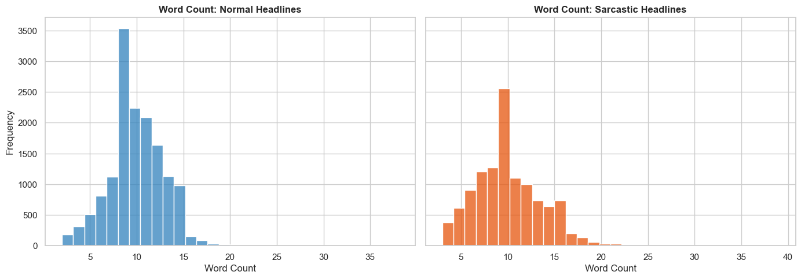
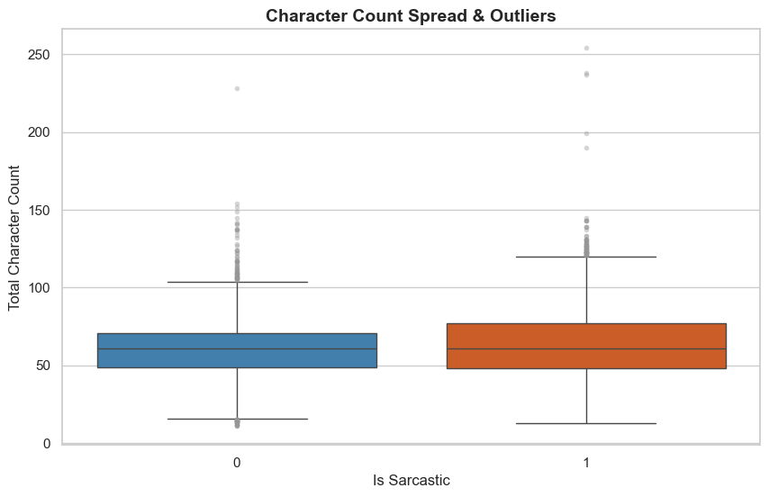
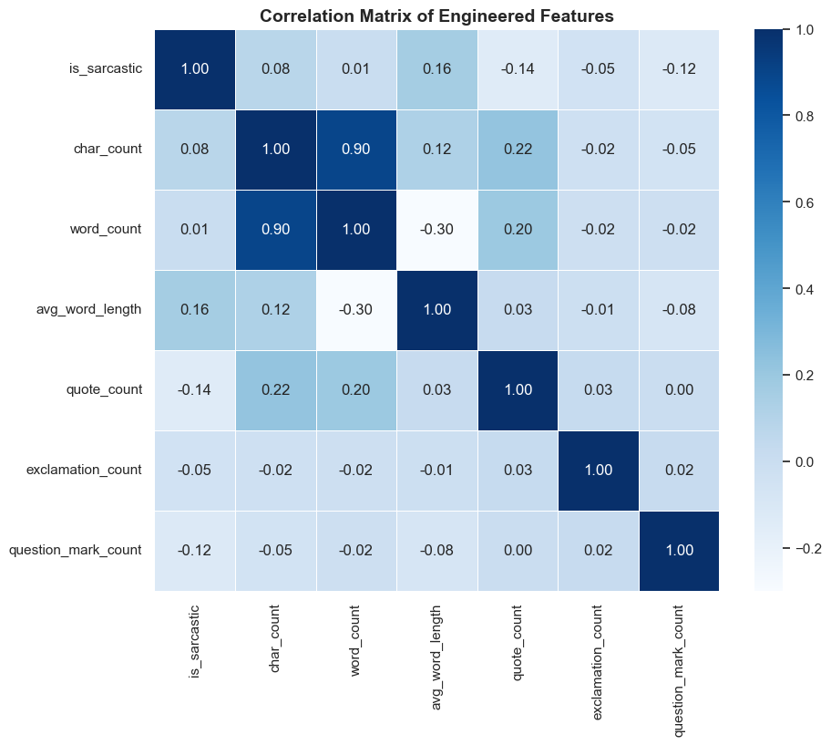
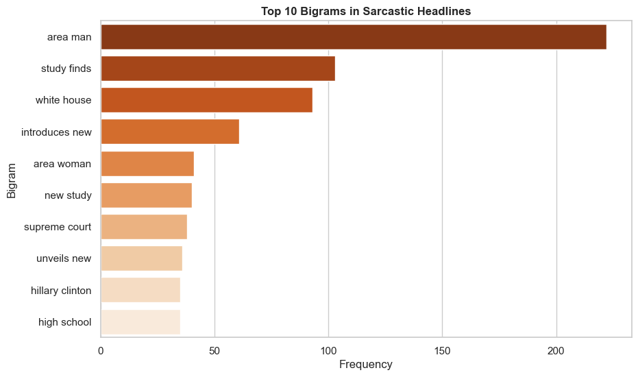
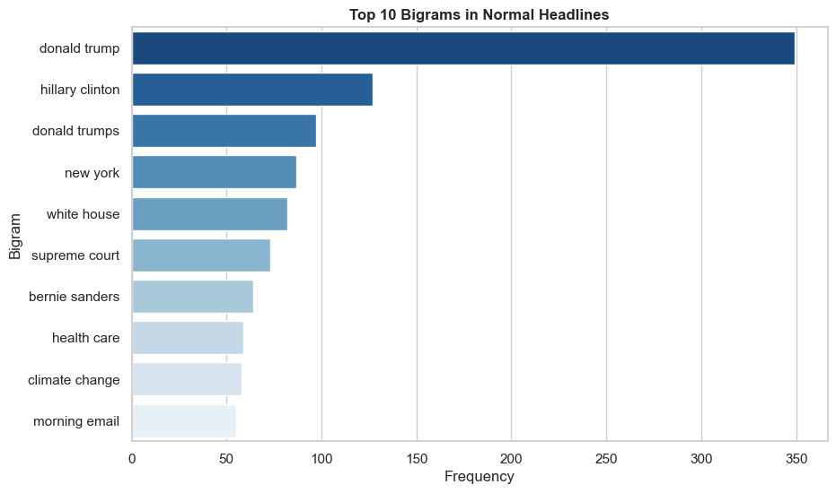

# IE 423 Term Project Proposal — Sarcasm Detection in News Headlines

---

## Team Information

- Ada Güner Nohut 122203012
- Onur Sarıdoğan 121203077
- Veli Erenay Açıl 122203072

---

## Dataset Description

We use the **News Headlines Dataset for Sarcasm Detection**, obtained from [Kaggle](https://www.kaggle.com/datasets/rmisra/news-headlines-dataset-for-sarcasm-detection).

This dataset contains news headlines collected from two distinct sources: *The Onion* (a well-known satirical news outlet that publishes intentionally sarcastic headlines) and *HuffPost* (a mainstream news outlet that publishes factual, non-sarcastic headlines). Each headline is labeled as either sarcastic (`1`) or non-sarcastic (`0`), making this a binary classification problem.

We selected this dataset because sarcasm detection is one of the most challenging tasks in Natural Language Processing (NLP). Unlike standard sentiment analysis, sarcasm relies on subtle stylistic cues — tone, exaggeration, punctuation patterns — rather than explicit positive or negative words. This makes the dataset ideal for exploring whether classical machine learning methods enhanced with deliberate feature engineering can capture these signals without deep learning.

The dataset contains **26,709 observations** and **3 variables** in its raw form (`headline`, `is_sarcastic`, `article_link`). After preprocessing and feature engineering, the processed dataset expands to **9 variables**.

---

## Dataset Access

The dataset is stored in:

```
data/raw/Sarcasm_Headlines_Dataset.json
```

If the dataset needs to be downloaded manually, it is available at:

> https://www.kaggle.com/datasets/rmisra/news-headlines-dataset-for-sarcasm-detection

After downloading, place the file inside:

```
data/raw/
```

---

## Research Questions

### Research Question 1

**Is sarcasm betrayed by how something is said rather than what is said? Do stylistic features such as punctuation density and word length carry a stronger signal for sarcasm detection than the actual word content?**

**Explanation:**
When a person writes "GREAT job everyone!!!", the sarcastic intent is not
carried by the word "great" itself — it is carried by the capitalization,
the exclamation marks, and the rhythm of the sentence. Standard text
classification algorithms treat words as isolated units and would count
"great" as a positive signal regardless of context. This research question
challenges that assumption by asking whether engineered structural features
— such as exclamation mark count, quote density, and average word length —
carry a more reliable sarcastic signal than the actual words used. By
comparing models trained on stylistic features against models trained on
word frequencies, we aim to mathematically determine whether *how something
is said* matters more than *what is said* in detecting sarcasm. The per-class
feature summary table generated by `scripts/03_basic_eda.py` provides early
evidence for this comparison.

---

### Research Question 2

**How do sarcastic texts deceive standard sentiment analysis tools, and how frequently do positive words appear in headlines that are actually sarcastic?**

**Explanation:**
Sentiment analysis libraries such as VADER or TextBlob assign polarity scores
to texts based on the emotional weight of individual words. Sarcasm, however,
exploits this mechanism: a headline like "Brilliant move, exactly what we
needed" would receive a strongly positive sentiment score while conveying
the opposite meaning. This research question investigates the frequency of
inherently positive words (e.g., "great", "amazing", "wonderful") within
sarcastic headlines, and examines how systematically these tools are misled.
By applying a sentiment analysis pipeline to both classes and comparing the
resulting score distributions, we aim to quantify the gap between
surface-level positivity and true communicative intent — and expose a
fundamental limitation of word-level NLP approaches when confronted with
ironic language.

---

### Research Question 3

**Can classical machine learning models detect sarcasm by looking at word frequencies alone (TF-IDF), or do they need to examine word pairs (bigrams) to capture the contextual signals that make a headline sarcastic?**

**Explanation:**
Classical machine learning algorithms such as Logistic Regression or Naive
Bayes typically evaluate each word independently. The word "brilliant" alone
carries a positive connotation; the word "disaster" alone carries a negative
one. But the bigram "brilliant disaster" — two words appearing together —
immediately signals sarcasm to any human reader. This research question
investigates how much contextual understanding is gained when we move from
single-word (unigram) to paired-word (bigram) feature representations, and
whether this gain is sufficient for classical algorithms to meaningfully
improve their sarcasm detection accuracy. The top bigram charts produced by
`scripts/03_basic_eda.py` already show that sarcastic and normal headlines
have markedly different bigram profiles — this question will quantify those
differences through model performance comparisons.

---

## Project Proposal

This project aims to investigate whether sarcasm in English news headlines can be reliably detected using classical machine learning methods enhanced with deliberate feature engineering — without relying on deep learning or transformer-based models.

First, we cleaned and preprocessed the raw dataset by expanding contractions, removing digits and punctuation, standardizing text to lowercase, and filtering out headlines shorter than three words. In addition to text cleaning, we engineered six structural features directly from the raw headlines: character count, word count, average word length, quote count, exclamation mark count, and question mark count. Crucially, these features were extracted before text cleaning to preserve the original stylistic signals.

Next, we conducted exploratory data analysis (EDA) to understand class balance, length distributions, outlier patterns, feature correlations, and the most frequent bigrams in each class. These outputs provide the empirical foundation for our three research questions.

Going forward, we plan to apply and compare at least three classical classification algorithms — Logistic Regression, Random Forest, and a Naive Bayes variant — using different feature sets: TF-IDF only, engineered features only, and a combined representation. We will also apply a sentiment analysis pipeline (VADER) to both classes to directly address Research Question 2. Model performance will be evaluated using accuracy, precision, recall, and F1-score. Length-based subgroup analysis will be conducted separately to address Research Question 2, and unigram vs bigram comparisons will be performed to address Research Question 3.

Our goal is not only to build a model, but also to generate interpretable findings about what linguistic signals carry the most sarcastic weight — and to expose the fundamental limitations of word-level NLP tools when confronted with ironic language. Possible challenges include the inherent subjectivity of sarcasm labels, the risk of overfitting on stylistic features unique to *The Onion*'s writing style, and the limited expressiveness of classical models on short texts.

---

## Preprocessing Steps

### Step 1 — Loading the Data

The dataset was loaded using `scripts/01_load_data.py`. The script reads the raw JSON file (newline-delimited format) using `pd.read_json(lines=True)` into a Pandas DataFrame and performs an initial structural inspection including shape, column names, data types, exact memory usage (`memory_usage='deep'`), missing values, duplicate counts, and class distribution with percentage breakdowns.

### Step 2 — Initial Inspection

Using `scripts/01_load_data.py`, we checked:

- **Shape:** 26,709 rows x 3 columns in the raw dataset
- **Columns:** `headline`, `is_sarcastic`, `article_link`
- **Missing values:** None detected (verified via `df.isnull().sum()`)
- **Data types:** `headline` (object), `is_sarcastic` (int64), `article_link` (object)
- **Duplicates:** Duplicate headlines found and flagged for removal in preprocessing
- **Class balance:** Approximately 52% non-sarcastic, 48% sarcastic

### Step 3 — Feature Engineering & Cleaning

Using `scripts/02_preprocess_data.py`, we performed the following operations **in this exact order** (order matters — features must be extracted from the original text before cleaning removes punctuation):

1. **Duplicate removal** — Exact duplicate headlines were dropped using `drop_duplicates(subset=['headline'])`.
2. **Column cleanup** — The `article_link` column was dropped as it is not relevant to the analysis.
3. **Structural feature engineering** (from raw `headline`):
   - `char_count` — total number of characters
   - `word_count` — total number of whitespace-separated tokens
   - `avg_word_length` — mean character length per word, calculated by summing individual word lengths and dividing by word count (excluding whitespace from the calculation)
   - `quote_count` — count of `"` and `'` characters
   - `exclamation_count` — count of `!` characters
   - `question_mark_count` — count of `?` characters
4. **Text cleaning** (applied to produce `cleaned_headline`):
   - Contraction expansion (e.g., "can't" -> "cannot", "won't" -> "will not") using a predefined contraction map
   - Lowercasing
   - Digit removal (`re.sub(r'\d+', '', text)`)
   - Punctuation removal (`re.sub(r'[^\w\s]', '', text)`)
   - Excess whitespace removal and stripping
5. **Integrity filtering:**
   - Rows where `cleaned_headline` is empty after cleaning were removed.
   - Headlines shorter than 3 words were removed (too short for meaningful NLP features).

### Step 4 — Saving Processed Data

The cleaned dataset was saved to:

```
data/processed/cleaned_sarcasm_data.csv
```

**Final processed dataset columns (9 total):** `headline`, `cleaned_headline`, `char_count`, `word_count`, `avg_word_length`, `quote_count`, `exclamation_count`, `question_mark_count`, `is_sarcastic`

---

## Initial Outputs

### Dataset Shape

After loading, the raw dataset contains **26,709 rows** and **3 columns**. After preprocessing (duplicate removal, column cleanup, and integrity filtering), the processed dataset is saved with **9 columns**.

### Missing Value Summary

No missing values were detected in any column of the raw dataset. This was verified by `scripts/01_load_data.py` using `df.isnull().sum()`.

### Statistical Summary Table

The per-class mean comparison table below was generated by `scripts/03_basic_eda.py` and saved to `outputs/tables/feature_summary_by_class.csv`. It shows the average values of all engineered features grouped by class (Normal vs Sarcastic), directly supporting Research Question 1.

> Full table available at: `outputs/tables/feature_summary_by_class.csv`

### Class Distribution

The class distribution bar chart shows the balance between sarcastic and non-sarcastic headlines with percentage annotations. Generated by `scripts/03_basic_eda.py`.



### Word Count Distribution by Class

Side-by-side histograms comparing word count distributions between normal and sarcastic headlines. Sarcastic headlines tend to be slightly longer on average. Generated by `scripts/03_basic_eda.py`.



### Character Count Spread & Outliers

The boxplot reveals that both classes contain outlier headlines with unusually high character counts. These outliers are retained in the dataset. Generated by `scripts/03_basic_eda.py`.



### Correlation Matrix of Engineered Features

The heatmap displays pairwise Pearson correlations between all engineered structural features and the target variable `is_sarcastic`. Generated by `scripts/03_basic_eda.py`.



### Top 10 Bigrams — Sarcastic Headlines

Bigrams were extracted using `sklearn.feature_extraction.text.CountVectorizer` with English stop words removed. Sarcastic headlines show recurring hyperbolic and satirical two-word patterns. Generated by `scripts/03_basic_eda.py`.



### Top 10 Bigrams — Normal Headlines

Normal headlines are dominated by topical political and geographic bigrams, in contrast to the more abstract patterns found in sarcastic ones. Generated by `scripts/03_basic_eda.py`.



---

## How to Run the Project

### 1. Clone the repository

```bash
git clone [your-repository-link]
cd [repository-name]
```

### 2. Install required packages

```bash
pip install -r requirements.txt
```

### 3. Place the dataset

Download the dataset from:
> https://www.kaggle.com/datasets/rmisra/news-headlines-dataset-for-sarcasm-detection

Put the dataset file inside:

```
data/raw/
```

### 4. Run the scripts

```bash
python scripts/01_load_data.py
python scripts/02_preprocess_data.py
python scripts/03_basic_eda.py
```

---

## Transparency and Traceability

All outputs presented in this markdown file are generated from the Python scripts in the `scripts/` folder. Figures are stored in `outputs/figures/`, tables are stored in `outputs/tables/`, and cleaned datasets are stored in `data/processed/`.

| Output Type | Location | Generated By |
|---|---|---|
| Figures (6 plots) | `outputs/figures/` | `scripts/03_basic_eda.py` |
| Feature Summary Table | `outputs/tables/feature_summary_by_class.csv` | `scripts/03_basic_eda.py` |
| Cleaned Dataset | `data/processed/cleaned_sarcasm_data.csv` | `scripts/02_preprocess_data.py` |

The repository is designed so that another user can reproduce the same outputs by installing the required packages and running the three scripts in order. No manual data manipulation was performed outside of the Python pipeline.
